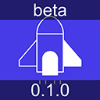

# FAQs

## Where did you come up with this?

By no means is this the 'right' or 'only' way to build a React or React Native App. We have however, worked on various apps built with React and React Native, that are 'in the wild' right now. So the ideas presented here are simply based on experience.

## Code Style Guide?

We're using [Airbnb's](https://github.com/airbnb/javascript) JS/React Style Guide with ESLint linting. We just like it :)

## Is this a "Universal" app?

To be clear, No it isn't. We've tried sharing absolutely everything across web and native mobile apps - and have run into road blocks where we've needed to undo the "universalism".

Our opinion for performant and maintainable solutions, is to:

- Share things like data structures, libraries and business logic
- And hand craft optimal user-interfaces for each platform

## React, hah? How do I?

[React Native Express](http://www.reactnativeexpress.com/) is a great site to get you started, specifically:

- [Get your head around ES6](http://www.reactnativeexpress.com/es6)
- [What is JSX?](http://www.reactnativeexpress.com/jsx)
- [What are Components?](http://www.reactnativeexpress.com/components)
- [React State](http://www.reactnativeexpress.com/data_component_state)
- [Redux](http://www.reactnativeexpress.com/redux)

Once you've got your head around the basics, checkout the [React Native](https://facebook.github.io/react-native/) and [React](https://reactjs.org/) websites, specifically

- Go through ['The Basics'](https://facebook.github.io/react-native/docs/props.html)
- Gain an understanding of the [components](https://facebook.github.io/react-native/docs/activityindicator.html) React Native provides out of the box

## How do I customize the App Display Name and Expo Icon?

You can edit `app.json` to include [configuration keys](https://docs.expo.io/versions/latest/guides/configuration.html) under the `expo` key.

To change your app's display name, set the `name` key in `app.json` to an appropriate string.

To set an app icon, set the `icon` key in `app.json` to be either a local path or a URL. It's recommended that you use a 512x512 png file with transparency.

## How do I eject from 'Create React Native App' and Expo?

If you want to build and deploy your app yourself, you'll need to eject from CRNA and use Xcode and Android Studio.

This is usually as simple as running `npm run eject` in your project, which will walk you through the process. Make sure to install `react-native-cli` and follow the [native code getting started guide for React Native](https://facebook.github.io/react-native/docs/getting-started.html).

## How do I customize the Native Icon?

Once you have ejected the app, you might want to change the app icons for iOS and Android. You can use the [app-icon](https://github.com/dwmkerr/app-icon) utility to generate all of the required icons for each required size.

Install the tool with `npm install -g app-icon`, or if you are using NPM 5.2.0 or later use [npx](https://medium.com/@maybekatz/introducing-npx-an-npm-package-runner-55f7d4bd282b) to run the tool without installing it:


```bash
npx app-icon generate -i ./src/images/app-icon.png
```

This will generate the icon in all required sizes. You can also add labels to icons, which can be useful for testing. This example labels the icon with 'beta' and the current version number:

```bash
npx app-icon label -i ./src/images/app-icon.png -o temp.png --top beta --bottom $(jq .version package.json)
npx app-icon generate -i temp.png
```


